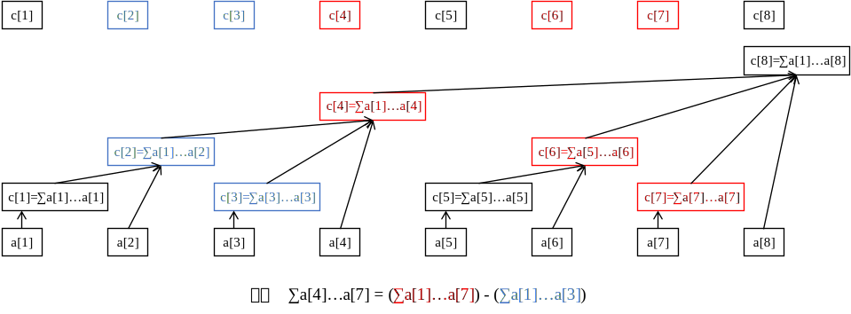

# 树状数组

- 树状数组能解决的问题是线段树的子集
- 类似前缀和，只是不再只每个位置都计算前面的所有结果，而是类似树结构



- 数组中的信息满足

  - 结合律 $(x \circ y )\circ z = x \circ (y \circ  x)$
  - 可拆分 $x \circ y, x \rightarrow y$

- 对于数组中的每个位置，其包含的实际长度按如下方式计算

  - 第 $i$ 个位置（从 1 起始），其二进制形式的最低位（从 0 起始）的 1 所在第  $x$ 位

    - 该位置包含的实际长度为 $2^x$ 
    - 例如 $8_{10}$ = $1000_2$，如图中 $c_8$ 管理 $2^3 = 8$​ 个实际位置
    - 例如 $7_{10} = 111_2$，如图中 $c_7$ 管理 $2^0 = 1$ 个实际位置
    - 例如 $6_{10} = 110_2$，如图中 $c_6$ 管理 $2^1 = 2$​ 个实际位置

  - 这是因为树状数组每层的分组长度按照 $\log n$​ 得到

  - 每个正数 $a$ 的相反数的补码表示刚好和该正数在其最低位1之前（包括最低位 1）都相同

    - 进而正数的最低位 1 形成的 $2^x$ 可以表示为 
      $$
      2^x = a \& -a
      $$
      即正数与其相反数的补码按位取和

  - 进而

    - 对于前 2 的幂 $2^y$ 个数，可以直接找第 $2^y$​ 个坐标（从 1 起始）
    - 对于第 $y$ 个数（从 1 起始），坐标 $y$​ （从 1 起始）里一定包含它，但是不一定包含前面所有元素
    - 反过来，第 $a$ 个下标的父节点坐标为 $a + 2^x$ 

- 寻找区间 $[x, y]$

  - 分别找 $[1, x]$ 和 $[1, y]$ ，两者相减
  - 找区间 $[1, x]$
    - 从下标 $x$ 开始向前找 $x$ 个数
    - 在每个不到达 1 的位置减去当前包含的个数$\text{len}(c_x)$，然后向前移到 $x'-\text{len}(c_x)$​

- 更新节点

  - 每次更新一个点后只需要不断更新其父节点
  - 更新第 $x$ 个点则其第一次出现在 $c_x$ 里


```python
N = len(keys) + 1
fens = [0] * N # fens 有效长度和有效元素一致

def lowerbit(i):
    return i & -i

def get(i):
    result = 0
    while i:
        result += fens[i]
        i -= lowerbit(i)
    return result

def update(i, delta=1):
    while i < len(fens):
        fens[i] += delta
        i += lowerbit(i)
    
def build_fens(fens, nums):
    for i, num in enumerate(nums):
        '''
        nums 下标从0开始，fens 从1开始
        '''
        i += 1
        update(fens, i, num)
```


- 327.[前缀和的个数](https://leetcode.cn/problems/count-of-range-sum/)
- 315.[逐个更新取值](https://leetcode.cn/problems/count-of-smaller-numbers-after-self/)
- 493.[较简单的额外条件](https://leetcode.cn/problems/reverse-pairs/)
- 3161.[动态数组区间最大值](https://leetcode.cn/problems/block-placement-queries/)
