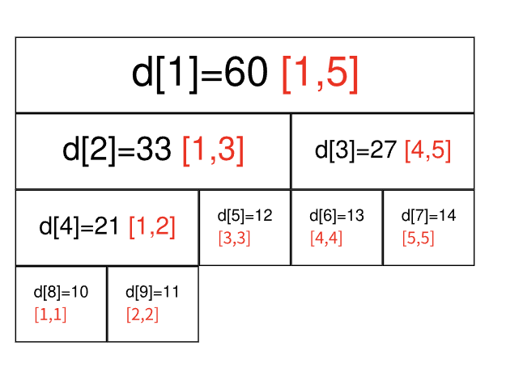

# 线段树




- 长度超过 1 的区间不断二分递归求解
- 堆式存储，
  - 叶子节点 $n$ 个，tree 最多 $2^{\lceil \\log n \rceil + 1}$​ 个
  - 下标从 1 开始

```python
n = len(nums)
tree = defaultdict(int)
deltas = defaultdict(int)

def build(nums, tree, left, right, i):
    if left == right:
        tree[i] = nums[left]
        return
    
    mid = left + ((right-left) >> 1)
    build(nums, tree, left, mid, 2*i)
    build(nums, tree, mid+1, right, 2*i+1)
    
    tree[i]= tree[2*i] + tree[2*i + 1]

def get(tree, left, right, nowleft, nowright, i): 
    if nowleft >= left and nowright <= right:
        return tree[i]
    
    nowmid = nowleft + ((nowright - nowleft) >> 1)
    if deltas[i]:
        tree[2*i] += deltas[i] * (nowmid - nowleft + 1)
        tree[2*i] += deltas[i]
        
        tree[2*i+1] += deltas[i] * (nowright - nowmid)
        tree[2*i+1] += deltas[i]
        
        deltas[i] = 0
    
    _sum = 0
    if nowmid >= left:
        _sum += get(tree, left, right, nowleft, nowmid, 2*i)
    if nowmid < right:
        _sum += get(tree, left, right, nowmid+1, nowright, 2*i + 1)
    return _sum

'''
区间变化
'''
def update_span_with_delta(tree, left, right, nowleft, nowright, i, delta):
    # 写入本次更新
    if nowleft >= left and nowright <= right:
        tree[i] += delta * (nowright - nowleft + 1)
        deltas[i] += delta
        return

    nowmid = nowleft + ((nowright - nowleft) >> 1)
    # 完成之前留下来的更新
    if deltas[i]:   
        if nowleft != nowright:
            tree[2*i] += deltas[i] * (nowmid - nowleft + 1)
            tree[2*i] += deltas[i]

            tree[2*i+1] += deltas[i] * (nowright - nowmid)
            tree[2*i+1] += deltas[i]
        deltas[i] = 0
    
    if nowmid >= left:
        update_span_with_delta(tree, left, right, nowleft, nowmid, 2*i, delta)
    if nowmid < right:
        update_span_with_delta(tree, left, right, nowmid+1, nowright, 2*i + 1, delta)
    tree[i] = tree[2*i] + tree[2*i+1]
```

```python
n = len(nums)
tree = defaultdict(int) 
varies = defaultdict(int) 

'''
i 从 1 开始
'''
def build(nums, tree, left, right, i):
    if left == right:
        tree[i] = nums[left]
        varies[i] = None
        return

    mid = left + ((right-left) >> 1)
    build(nums, tree, left, mid, 2*i)
    build(nums, tree, mid+1, right, 2*i+1)
    
    tree[i]= tree[2*i] + tree[2*i + 1]
    varies[i] = None

def get(tree, left, right, nowleft, nowright, i): 
    if nowleft >= left and nowright <= right:
        return tree[i]
    
    nowmid = nowleft + ((nowright - nowleft) >> 1)
    if varies[i] is not None:
        tree[2*i] = (nowmid - nowleft + 1) * varies[i]
        varies[2*i] = varies[i]
        
        tree[2*i+1] = (nowright - nowmid) * varies[i]
        varies[2*i+1] = varies[i]
        varies[i] = None
    
    _sum = 0
    if nowmid >= left:
        _sum += get(tree, left, right, nowleft, nowmid, 2*i)
    if nowmid < right:
        _sum += get(tree, left, right, nowmid+1, nowright, 2*i + 1)
    return _sum

'''
区间变为指定值
'''
def update_span_to_a_value(tree, left, right, nowleft, nowright, i, value):
    if nowleft >= left and nowright <= right:
        tree[i] = value * (nowright - nowleft + 1)
        varies[i] = value
        return
    
    nowmid = nowleft + ((nowright - nowleft) >> 1)
    if varies[i] is not None:
        tree[2*i] = (nowmid - nowleft + 1) * varies[i]
        varies[2*i] = varies[i]
        
        tree[2*i+1] = (nowright - nowmid) * varies[i]
        varies[2*i+1] = varies[i]
        varies[i] = None

    if nowmid >= left:
        update_span_to_a_value(tree, left, right, nowleft, nowmid, 2*i, value)
    if nowmid < right:
        update_span_to_a_value(tree, left, right, nowmid+1, nowright, 2*i + 1, value) 
    tree[i] = tree[2*i] + tree[2*i+1]
```

- 动态开点
  - 只在有需要时创建下一个节点


```python
# 区间最小值
n = len(nums)
tree = [-1] * ((2 << n.bit_length()))

def build():
    def selfupdate(i):
        tree[i] = tree[i*2] if nums[tree[i*2]] <= nums[tree[i*2 + 1]] else tree[i*2 + 1]

    def dfs(i, l, r):
        if l == r:
            tree[i] = l
            return

        mid = l + ((r - l) >> 1)
        dfs(i * 2, l, mid)
        dfs(i * 2 + 1, mid+1, r)
        selfupdate(i)

    dfs(1, 0, n-1)

def find(L, R):
    def dfs(i, l, r):
        if L <= l and r <= R:
            return tree[i]

        mid = l + ((r - l) >> 1)
        if mid >= R:
            return dfs(i*2, l, mid)
        elif mid < L:
            return dfs(i*2 + 1, mid+1, r)
        else:
            tl = dfs(i*2, l, mid)
            tr = dfs(i*2 + 1, mid+1, r)
            return tl if nums[tl] <= nums[tr] else tr
    return dfs(1, 0, n-1)
```

```python
# 区间最大值
class Tree:
    def __init__(self):
        self.tree = defaultdict(lambda : [0, 0])
    
    def update(self, L, R, d):
        tree = self.tree

        def dfs(i, l, r):   
            if L <= l and r <= R:
                tree[i][0] += d
                tree[i][1] += d
                return

            mid = l + ((r - l) >> 1)
            if mid >= R:
                dfs(2 * i, l, mid)
            elif mid < L:
                dfs(2 * i + 1, mid + 1, r)
            else:
                dfs(2 * i, l, mid)
                dfs(2 * i + 1, mid + 1, r)
            
            tree[i][0] = tree[i][1] + max(tree[2 * i][0], tree[2 * i + 1][0]
        dfs(1, 0, N)
    
    def find(self, L, R):
        tree = self.tree

        def dfs(i, l, r):
            if L <= l and r <= R:
                return tree[i][0]

            mid = l + ((r - l) >> 1)
            t1, t2 = -inf, -inf
            if mid >= R:
                t1 = dfs(2 * i, l, mid)
            elif mid < L:
                t2 = dfs(2 * i + 1, mid + 1, r)
            else:
                t1 = dfs(2 * i, l, mid)
                t2 = dfs(2 * i + 1, mid + 1, r)
            
            return max(t1, t2) + tree[i][1]
        return dfs(1, 0, N)
```


### 例题

- 2454.[拆解两遍](https://leetcode.cn/problems/next-greater-element-iv/description/)
- 1906.[线段树节点为其他数据结构](https://leetcode.cn/problems/minimum-absolute-difference-queries/) 
- 2024.[两侧划分](https://leetcode.cn/problems/maximum-subarray-min-product)
- 3165.[线段树上的动态规划](https://leetcode.cn/problems/maximum-sum-of-subsequence-with-non-adjacent-elements/)
- 732.[区间更新线段树](https://leetcode.cn/problems/my-calendar-iii/description/)
